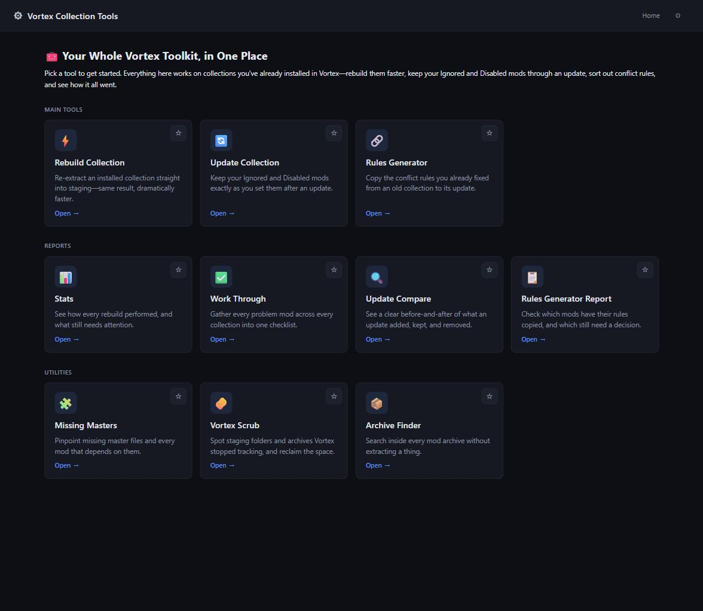

# Vortex Collection Tools

> **Rebuild a broken Vortex collection at full speed, and stop losing your Ignored/Disabled mods every time you update one — all from a simple local web page.**

---

## ⚡ Overview

Vortex works fine for a small mod list, but at real scale (1,000+ mods) it freezes, forgets your
settings, and burns hours on installs and updates. Vortex Collection Tools runs alongside Vortex to
fix its biggest pain points: rebuilding a collection when files go missing or corrupted, updating a
collection without losing track of every mod you'd marked Ignored or Disabled, and keeping your
custom mod-order rules intact when a collection gets updated, and merging plugins together to reclaim
load-order slots. A set of smaller Utilities rounds it
out — clearing away leftover mod clutter, catching missing master files before they crash your
game, and finding any file inside any archive without unpacking it. Every tool lives behind one
Home page, so you're never more than a click away from the one you need.

### 📋 At a Glance

| Feature | Details |
| :--- | :--- |
| **Requirements** | A local web page you run yourself — nothing is sent anywhere else. Release zip bundles its own Node.js and 7-Zip, nothing else to install |
| **Nexus Account** | Free works for most tools. A few features — like automatically downloading a missing archive — need Nexus Premium, the same rule Nexus itself applies to free accounts. Everywhere that's the case, you'll get a clear note and a way to grab the file yourself instead |
| **Performance Impact** | Rebuilds run 2-3x faster with parallel extraction (up to 8 mods at once) |
| **Safety** | Every live database write takes a full backup automatically first; never touches your Skyrim save files |
| **Compatibility** | Vortex-managed Skyrim SE mod collections |

---

## ✨ Key Features

* **Puts every tool in one place:** The app opens to a Home page with every tool as its own card,
  grouped by what it does. Pin the ones you use most so they're always the first thing you see, and
  every page shows you exactly where you are, with one click back to Home.
* **Settings, all in one easy-to-scan place:** Pick a category on the left, see just its settings
  on the right — instead of one long scrolling page. Pin the ones you touch most, same as the Home
  page.
* **Rebuilds mods at full speed:** Extracting a big collection inside Vortex takes hours and can
  even run your PC out of memory. This tool extracts the same files — including FOMOD installer
  choices — outside of Vortex, at full speed. ⚡ Turn on parallel extraction (up to 8 mods at once)
  under Settings to cut that time down further, typically 2-3x faster depending on your drive.
* **Pause a rebuild and pick it up later:** Extracting 1,000+ mods can take a while. Pause partway
  through, close the app, and resume right where you left off whenever you're ready — nothing
  already finished gets redone.
* **Downloads missing mods for you:** No more manually hunting down missing archive files on Nexus
  one by one. If you have Nexus Premium, this tool detects what's missing and downloads the exact
  version your collection needs, automatically.
* **Checks for missing files without a full rebuild:** Something not working in-game usually means
  a few files quietly went missing from staging — not your whole collection. Rebuild Missing Files
  checks one or more collections, shows you exactly what's gone mod by mod, and restores just those
  files straight from the archive.
* **See when you actually last touched a Workshop collection:** Nexus shows a fixed date for a
  private collection that never changes, even as you keep working on it. Workshop Report pulls the
  real timestamp from the collection's own revision history instead, so you can sort newest to
  oldest and spot exactly which ones are overdue for an update.
* **Keeps your Ignored/Disabled choices:** Updating a collection in Vortex normally forgets which
  mods you'd marked Ignored or Disabled, leaving you to dig through a list of 1,900+ mods to turn
  off the same 35 again. This tool snapshots those choices before the update and restores them
  automatically once it's done — no manual cleanup. The whole update now walks you through it one
  clear step at a time, so you always know what to do and when.
* **Rebuilds your custom mod-order rules after an update:** Updating a collection can leave the
  "load after"-style rules you'd set up pointing at nothing. Rules Generator matches your old rules
  to their counterparts in the updated collection automatically — even auto-updating a rule that
  used to point at an older version of a mod — so you're not manually re-linking hundreds of mods
  by hand.
* **Fixes broken and missing files instantly:** Whether caused by accidental deletion, Windows
  errors, or an unexpected Vortex deployment hiccup, this tool identifies missing or corrupted
  files and extracts fresh copies straight from your archives to get mods working again.
* **Leaves your Ghost files alone:** Vortex marks disabled files with a `.ghost` extension.
  Reinstalling a mod normally wipes these out or creates confusing duplicates — this tool detects
  `.ghost` files and leaves them untouched, so your custom file tweaks survive a reinstall.
* **Shows you exactly what changed:** Every step previews what it's about to do before it touches
  anything real, and the Compare Report gives you a clear, color-coded summary of what was kept,
  disabled, added, or removed by the collection author.
* **Cleans up mod-manager clutter safely:** Vortex Scrub finds staging folders and downloaded
  archives Vortex no longer has any connection to — leftovers from a mod you uninstalled, or an old
  duplicate download — and lets you review and remove them, with a permanent exclude list for
  anything you want to keep around on purpose.
* **Catches missing master files before they crash your game:** Missing Masters shows you every
  active plugin whose master file isn't actually there — the classic Skyrim "missing master" crash
  — the moment it happens, with no manual rescan needed. Use **Create Dummy Master** to patch it
  instantly, or **Rebuild This Mod** to re-extract the real files if the install just came up empty.
* **Finds any file inside any archive, instantly:** Archive Finder indexes every archive in your
  downloads folder up front — no unpacking required — so you can search across all of them by file
  or mod name and pull out exactly the file you need, whenever you need it.
* **Merges plugins into one, freeing up load-order slots:** Skyrim's plugin limit fills up fast,
  especially with lots of small mods. Merge Plugins bundles new-content plugins from your
  collections into a single file — review exactly what's going in first — and flags the result ESL
  automatically when it qualifies, so it costs you 0 slots and the originals are safe to disable
  afterward.

---

## 📦 Getting Started

1. **Download the zip** from the [Releases page](../../releases) and unzip it anywhere.
2. **Close Vortex completely.**
3. **Double-click `start-server.bat`.** A console window stays open while it runs — that window
   staying open **is** how you know the server's running; don't close it while you're using the
   app.
4. **Set your paths.** Your browser opens to the app automatically — first time through, it'll ask
   for your staging/downloads folders under **Settings**. Do that once and you're set.

When you're done, stop the server with `stop.bat` (from anywhere), Ctrl+C in the console window, or
just clicking that window's **X** button — all three shut it down the same clean way.

> [!TIP]
> The release zip bundles its own Node.js and 7-Zip — there's no command line and nothing else to
> install. Full instructions are also in `START HERE.txt` inside the zip.

---

## ⚠️ Important Notes

> [!WARNING]
> Vortex needs to be fully closed for anything that reads or writes its live database: starting an
> actual rebuild or update, Rules Generator's **Apply to Vortex** step, Vortex Scrub's scan, and
> Missing Masters' **Rebuild This Mod**. If Vortex is still open when you try one of these, the app
> tells you right there and won't let you continue until you close it — you don't need to remember
> this list yourself.
>
> Everything else works fine with Vortex open: browsing Reports, Missing Masters' scan, editing
> Vortex Scrub's exclude list, and all of Archive Finder.

> [!NOTE]
> After you rebuild a collection, Vortex will likely show an **"External Changes"** prompt the next
> time you open it, for anything that got rebuilt. That's expected — go ahead and click through it
> ("Use newer file" / "Save all changes").

> [!CAUTION]
> Update Collection and Rules Generator's **Apply to Vortex** step both write directly to Vortex's
> live database. Each takes a full backup automatically before every write, but keeping a second,
> independent backup of your own never hurts.

---

## ❓ Frequently Asked Questions

* **Q: Does this touch my Skyrim save files?**
  > **No.** This tool only works with Vortex's mod staging folder and its own database — it never
  > reads or writes your Skyrim saves.

---

* **Q: What happens if something crashes mid-run?**
  > **It's isolated, so nothing else goes down with it.** Every database read/write runs in its own
  > short-lived worker process. If that worker crashes, it only affects that one operation — not
  > the rest of the app.

---

* **Q: Does Rebuild Collection write to Vortex's database?**
  > **No.** Rebuild Collection only ever touches your mod staging folder, using a crash-safe
  > swap so an interruption never leaves a half-extracted mod in place. Update Collection and Rules
  > Generator's **Apply to Vortex** step are the only two that write to Vortex's database, and both
  > always back it up in full first.

---

* **Q: What if I don't have Nexus Premium?**
  > **Everything still works** — you'll just need to download any missing archive manually from
  > the Nexus website and let Vortex install it, the same as you would without this tool.
  > Automatic downloads are a Nexus API restriction for free accounts, not a limitation of this
  > tool.

---

* **Q: I found a bug, or have feedback — what do I do?**
  > **Open an issue on GitHub.** Include what you were doing, what you expected, and what actually
  > happened — a screenshot helps a lot.

---

## 🛠️ Technical Details & Contributions

Building from source, command-line usage, how things work under the hood, and the project's
internals all live in [`TECHNICAL.md`](TECHNICAL.md).

---

## 🤝 Credits

* **Vortex** ([Nexus Mods](https://www.nexusmods.com/about/vortex/)) — the mod manager this tool
  reads and writes alongside.
* **Nexus Mods API** — used for automatic missing-archive downloads (Premium accounts only).
